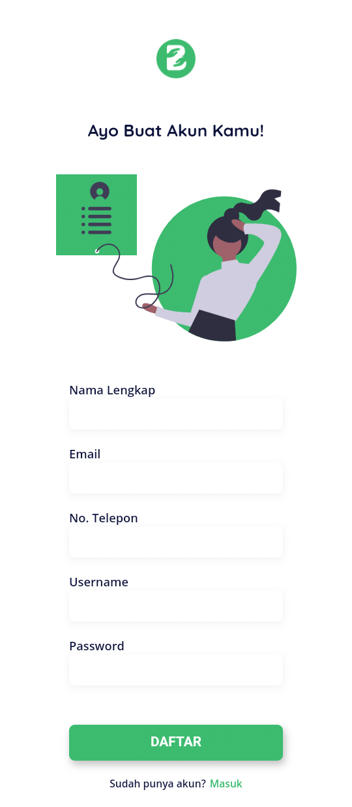
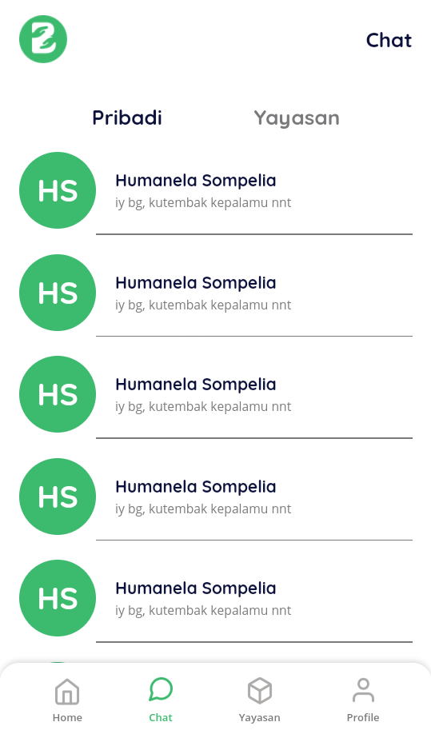

# Berbagi App
## About Berbagi App
Berbagi is an application to help people who want to donate their goods to find the people who need the donations, This is a project for Software Engineering Competition at Telkom University GEMASTIK VIII.
  
  
Date: August 2020

## Preview

### On Boarding Page

This page provide information about berbagi app.

### Sign up & Sign in Page

Page for user sign in or sign up to the Berbagi application.

  
  

### Home Page

Berbagi's homepage show the recent donation post.

### Post Page

This page provides info about the details of post donations such as what donations are needed and info about the oganization that need donations. 

### Organization Page

This page provides info about the details of an organization as address, contacts and all donation posts.

### Chat room

The chat rooms provide an interface for donors to be able to contact organizations or other user within the app.

### Profile

The profile page provide information about the details of user's account.

